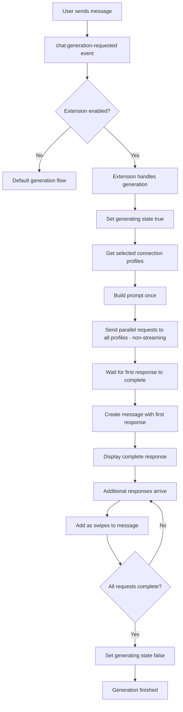

# Multi-Model Parallel Response Extension - Implementation Plan

## Overview

This extension will enable NeoTavern to send chat replies to multiple LLM models simultaneously, with the first response becoming the main response and subsequent responses being added as swipes.

**Important**: When this extension is enabled, it **overrides** the single backend connection setting. Users select multiple connection profiles within the extension settings instead of the global connection profile selector. All requests use non-streaming mode to avoid the complexity of managing concurrent streaming responses. The first complete response (from any model) is displayed immediately, with additional responses added as swipes as they complete.

**Generation State**: The loading/generation icon (stop button) remains in the "generation" state until ALL parallel requests have completed. This ensures users know when the full parallel generation process is finished, not just when the first response arrives.

## Feasibility Assessment

**YES, this is feasible.** Based on the NeoTavern architecture analysis:

1. **Extension API** provides access to:
   - `chat:generation-requested` event to intercept generation requests
   - `api.chat.generate()` for making LLM requests
   - `api.chat.buildPrompt()` for building prompts
   - `api.chat.updateMessageObject()` for modifying messages
   - Connection profile system for multiple API configurations

2. **Swipe System** supports:
   - Multiple alternative responses per message via `swipes` array
   - Dynamic addition of swipes to existing messages
   - `swipe_info` for tracking metadata per swipe

3. **LLM Generation** supports:
   - Parallel requests via `Promise.all()`
   - Custom connection profiles per request
   - Streaming and non-streaming modes

## Architecture Design

### System Flow



### Key Components

1. **Extension Entry Point** (`index.ts`)
   - Event handlers for generation requests
   - Settings management
   - UI registration

2. **Parallel Generation Service** (`ParallelGenerationService.ts`)
   - Manages parallel LLM requests (all non-streaming)
   - Handles response ordering
   - Manages abort controller

3. **Settings Panel** (`SettingsPanel.vue`)
   - Connection profile multi-selector (overrides global connection setting when extension is enabled)
   - Enable/disable toggle
   - Per-profile priority settings

4. **Types** (`types.ts`)
   - Extension settings interface
   - Response tracking types

## Implementation Plan

### Phase 1: Core Structure

1. Create extension directory structure
   - `src/extensions/built-in/multi-model-parallel/`
   - `index.ts` - Main entry point
   - `manifest.ts` - Extension metadata
   - `types.ts` - TypeScript types
   - `SettingsPanel.vue` - Settings UI

2. Define extension manifest
   - Name: "Multi-Model Parallel Response"
   - ID: `multi-model-parallel`
   - Description: Send chat to multiple models simultaneously

3. Define settings schema
   ```typescript
   interface MultiModelSettings {
     enabled: boolean;
     connectionProfiles: string[]; // Array of profile IDs
     maxSwipes: number; // Maximum number of swipes to generate
   }
   ```

### Phase 2: Generation Interception

1. Register `chat:generation-requested` event handler
   - Check if extension is enabled
   - Check if mode is NEW, REGENERATE, or ADD_SWIPE
   - Set `handled: true` to prevent default generation

2. Handle different generation modes:
   - **NEW**: Generate parallel responses, first becomes main response
   - **REGENERATE**: Delete last message, generate parallel responses
   - **ADD_SWIPE**: Generate additional parallel responses as new swipes

### Phase 3: Parallel Generation Service

1. Create `ParallelGenerationService` class with methods:
   - `generateParallel()`: Main method to orchestrate parallel requests
   - `buildRequestPayload()`: Build LLM request for each profile
   - `handleFirstResponse()`: Process and display first response
   - `handleAdditionalResponse()`: Add subsequent responses as swipes
   - `abort()`: Cancel all pending requests

2. Implement parallel request logic:

   ```typescript
   async generateParallel(
     profiles: ConnectionProfile[],
     messages: ApiChatMessage[],
     options: GenerationOptions
   ): Promise<void> {
     const controller = new AbortController();

     // Create all requests with stream: false (non-streaming)
     const requests = profiles.map(profile =>
       this.generateForProfile(profile, messages, controller.signal)
     );

     // Wait for first response to complete
     const firstResult = await Promise.race(requests);
     await this.handleFirstResponse(firstResult);

     // Process remaining responses as they complete
     // IMPORTANT: Keep generating state active until ALL requests complete
     for (const request of requests) {
       if (request !== firstResult) {
         const result = await request;
         await this.handleAdditionalResponse(result);
       }
     }

     // All requests complete - generation state will be cleared
   }

   private async generateForProfile(
     profile: ConnectionProfile,
     messages: ApiChatMessage[],
     signal: AbortSignal
   ): Promise<GenerationResponse> {
     // Force stream: false for all requests
     const payload = await this.buildRequestPayload(profile, messages);
     payload.stream = false;

     return await api.chat.generate(payload, 'chat', signal) as GenerationResponse;
   }
   ```

### Phase 4: Message and Swipe Management

1. Create message with first response:
   - Use `api.chat.createMessage()` for new messages
   - Set `swipes` array with initial response
   - Set `swipe_id` to 0

2. Add additional responses as swipes:
   - Use `api.chat.updateMessageObject()` to modify existing message
   - Push new responses to `swipes` array
   - Add corresponding `swipe_info` entries
   - Emit `message:swipe-changed` event

3. Generation state management:
   - Set generating state to `true` when starting parallel requests
   - Keep generating state `true` until ALL requests complete
   - Set generating state to `false` only after final response is added
   - This ensures the loading/stop icon shows until full generation is done

4. All requests use non-streaming mode:
   - Force `stream: false` in all request payloads
   - Display first complete response immediately
   - Add additional responses as swipes as they complete
   - This avoids the complexity of concurrent streaming

### Phase 5: Settings UI

1. Create SettingsPanel.vue with:
   - Enable/disable toggle (when enabled, overrides global connection profile)
   - Multi-select for connection profiles (replaces single profile selection)
   - Max swipes slider/input
   - Profile priority list (reorderable)
   - Visual indicator showing which profiles will be used

2. Use built-in components:
   - `MountableComponent.Toggle` for enable/disable
   - `MountableComponent.Select` for profile selection
   - `MountableComponent.RangeControl` for max swipes
   - `MountableComponent.DraggableList` for profile priority ordering

### Phase 6: Error Handling

1. Handle individual request failures:
   - Log errors but continue with other requests
   - Show toast notification for failed requests
   - Ensure at least one response succeeds

2. Handle abort scenarios:
   - Cancel all pending requests when user aborts
   - Clean up partial message state
   - Restore chat to consistent state

### Phase 7: Testing Considerations

1. Test scenarios:
   - Single profile selected (should behave like normal generation)
   - Multiple profiles with different providers
   - Extension enabled/disabled toggling (should restore global connection setting)
   - All requests non-streaming (extension enforces this)
   - Abort during generation
   - Network errors on some profiles
   - REGENERATE and ADD_SWIPE modes

2. Edge cases:
   - No profiles selected
   - All profiles fail
   - User switches chat during generation
   - Rapid successive generations

## Technical Challenges and Solutions

### Challenge 1: Generation State Management

**Problem**: The generation loading state must remain active until ALL parallel requests complete, not just the first one. Users need to know when the full parallel generation process is finished.

**Solution**:

- Set `api.chat.setGeneratingState(true)` when starting parallel requests
- Do NOT call `setGeneratingState(false)` after first response arrives
- Only call `setGeneratingState(false)` after `Promise.allSettled()` confirms all requests have completed (either resolved or rejected)
- This ensures the stop button remains visible until full generation is done

### Challenge 2: Connection Profile Override

**Problem**: The extension needs to override the global connection profile setting when enabled, and restore it when disabled.

**Solution**:

- When extension is enabled, store the current global connection profile
- Use extension's selected profiles for all generation requests
- When extension is disabled, restore the previously stored global profile
- Show visual indicator in UI that extension is overriding the global setting

### Challenge 2: Abort Coordination

**Problem**: Multiple parallel requests need coordinated abort.

**Solution**: Use single AbortController shared across all requests.

### Challenge 4: Swipe Index Management

**Problem**: Adding swipes in arbitrary order as responses complete.

**Solution**: Maintain response order array, map completion order to swipe index.

### Challenge 5: Profile Configuration

**Problem**: Different profiles may have incompatible settings.

**Solution**: Use profile's own settings, don't try to normalize across profiles.

## Extension API Usage

### Events Used

- `chat:generation-requested` - Intercept generation requests
- `chat:entered` - Initialize extension state
- `chat:cleared` - Clear internal state
- `generation:aborted` - Handle abort

### API Methods Used

- `api.chat.generate()` - Make LLM requests with specific connection profiles
- `api.chat.buildPrompt()` - Build prompt messages
- `api.chat.createMessage()` - Create new message
- `api.chat.updateMessageObject()` - Update message with swipes
- `api.chat.getHistory()` - Get chat history
- `api.chat.setGeneratingState()` - Set loading state
- `api.chat.abortGeneration()` - Abort generation
- `api.settings.getGlobal('api.connectionProfiles')` - Get available connection profiles
- `api.settings.getGlobal('api.selectedConnectionProfile')` - Get global connection profile (to restore when disabled)
- `api.ui.showToast()` - Show notifications
- `api.ui.registerChatSettingsTab()` - Register settings tab

## File Structure

```
src/extensions/built-in/multi-model-parallel/
├── index.ts                    # Main entry point, event handlers
├── manifest.ts                 # Extension metadata
├── types.ts                    # TypeScript type definitions
├── ParallelGenerationService.ts # Core parallel generation logic
├── SettingsPanel.vue           # Settings UI component
└── README.md                   # Extension documentation
```

## Configuration Example

```json
{
  "enabled": true,
  "connectionProfiles": ["openai-gpt4", "anthropic-claude", "local-llama"],
  "maxSwipes": 3
}
```

## Future Enhancements

1. **Profile Priority**: Allow users to prioritize certain profiles
2. **Response Quality Scoring**: Rate responses and suggest best one
3. **Cost Tracking**: Track token usage across all profiles
4. **Response Comparison**: Side-by-side comparison of responses
5. **Auto-Swipe Selection**: Automatically select best response based on criteria
6. **Per-Profile Prompts**: Allow different prompts per profile
7. **Response Merging**: Combine elements from multiple responses

## Dependencies

None - uses only built-in NeoTavern extension APIs.

## Core Code Changes

**NONE REQUIRED** - This extension is entirely self-contained within the extension folder and uses only the existing Extension API. No modifications to core NeoTavern files are needed, making it easy to merge and maintain.

The extension uses these existing Extension API methods:

- `api.chat.setGeneratingState()` - Control generation loading state
- `api.chat.generate()` - Make LLM requests with custom connection profiles
- `api.chat.buildPrompt()` - Build prompt messages
- `api.chat.createMessage()` - Create new messages
- `api.chat.updateMessageObject()` - Update messages with swipes
- `api.chat.getHistory()` - Get chat history
- `api.chat.abortGeneration()` - Abort generation
- `api.settings.getGlobal()` - Get connection profiles and settings
- `api.ui.showToast()` - Show notifications
- `api.ui.registerChatSettingsTab()` - Register settings tab
- `api.events.on()` - Listen to generation events

## Notes

- This extension is designed as a "built-in" extension (access to Vue components)
- Could be adapted to external extension with different UI approach
- Backend (SillyTavern) compatibility: This is frontend-only, works with any backend that supports the standard API
- Zero core code modifications required for easy merging
