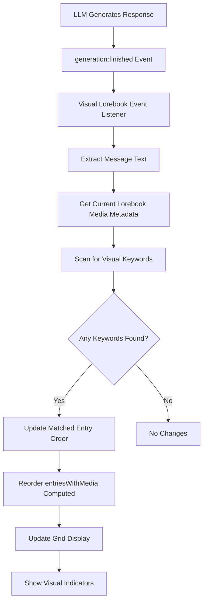

# Visual Lorebook Keyword Detection Implementation Plan

## Overview

This feature enhances the Visual Lorebook extension by detecting visual keywords in LLM response content and automatically bringing matching entries to the top of the panel grid. When a new keyword match occurs, that entry becomes the most recent match and moves to position 1.

## Behavior

- When a visual keyword is detected in a new LLM response, the matching entry moves to the top of the grid
- Matched entries maintain their position until a newer match occurs (leapfrog behavior)
- The order is: most recent match → second most recent match → ... → unmatched entries (sorted by UID)
- Visual indicators highlight which entries have been matched

## Architecture



## Implementation Steps

### 1. Add Matched Entry Tracking State

**File:** `src/extensions/built-in/visual-lorebook/VisualLorebookPanel.vue`

Add a ref to track the order of matched entries:

```typescript
// Track matched entries in order (most recent first)
const matchedEntryUids = ref<number[]>([]);
```

### 2. Implement Keyword Matching Logic

**File:** `src/extensions/built-in/visual-lorebook/VisualLorebookPanel.vue`

Add a function to scan message content for visual keywords:

```typescript
function findMatchingVisualKeywords(messageText: string): number[] {
  if (!selectedLorebook.value || !mediaMetadata.value) return [];

  const text = messageText.toLowerCase();
  const matchedUids: number[] = [];

  // Scan all entries with media for keyword matches
  for (const [uidStr, mediaData] of Object.entries(mediaMetadata.value.entries)) {
    const uid = Number(uidStr);
    const keyword = mediaData.visualKeyword?.trim();

    if (keyword && text.includes(keyword.toLowerCase())) {
      matchedUids.push(uid);
    }
  }

  return matchedUids;
}
```

### 3. Listen for Message Events

**File:** `src/extensions/built-in/visual-lorebook/VisualLorebookPanel.vue`

Hook into the `generation:finished` event to detect new messages:

```typescript
onMounted(() => {
  // Listen for generation finished to detect new LLM responses
  const unsubscribe = props.api.events.on('generation:finished', async (result, context) => {
    if (result.message && !result.message.is_user) {
      // This is an AI response, scan for visual keywords
      const matchedUids = findMatchingVisualKeywords(result.message.mes);

      if (matchedUids.length > 0) {
        // Update matched entry order (most recent first)
        // Remove any existing occurrences and prepend new matches
        matchedEntryUids.value = [
          ...matchedUids,
          ...matchedEntryUids.value.filter((uid) => !matchedUids.includes(uid)),
        ];
      }
    }
  });

  // Cleanup on unmount
  onUnmounted(() => {
    unsubscribe();
  });
});
```

### 4. Modify entriesWithMedia Computed Property

**File:** `src/extensions/built-in/visual-lorebook/VisualLorebookPanel.vue`

Update the sorting logic to prioritize matched entries:

```typescript
const entriesWithMedia = computed(() => {
  if (!selectedLorebook.value || !mediaMetadata.value) return [];

  const book = worldInfoStore.worldInfoCache[selectedLorebook.value];
  if (!book) return [];

  // Filter to only show entries that have media
  let entries = book.entries.filter((entry) => mediaMetadata.value!.entries[entry.uid]);

  // Filter by search query
  if (searchQuery.value) {
    const query = searchQuery.value.toLowerCase();
    entries = entries.filter(
      (entry) =>
        entry.key.some((k) => k.toLowerCase().includes(query)) ||
        entry.comment.toLowerCase().includes(query) ||
        entry.uid.toString().includes(query),
    );
  }

  // Sort: matched entries first (in order of most recent match), then by UID descending
  entries.sort((a, b) => {
    const aMatchIndex = matchedEntryUids.value.indexOf(a.uid);
    const bMatchIndex = matchedEntryUids.value.indexOf(b.uid);

    // If both are matched, sort by match order (lower index = more recent)
    if (aMatchIndex !== -1 && bMatchIndex !== -1) {
      return aMatchIndex - bMatchIndex;
    }
    // If only a is matched, it comes first
    if (aMatchIndex !== -1) return -1;
    // If only b is matched, it comes first
    if (bMatchIndex !== -1) return 1;
    // Neither matched, sort by UID descending (newest first)
    return b.uid - a.uid;
  });

  return entries;
});
```

### 5. Add Visual Indicator for Matched Entries

**File:** `src/extensions/built-in/visual-lorebook/VisualLorebookPanel.vue`

Add a computed property to check if an entry is matched:

```typescript
function isEntryMatched(entryUid: number): boolean {
  return matchedEntryUids.value.includes(entryUid);
}

function getMatchPosition(entryUid: number): number | null {
  const index = matchedEntryUids.value.indexOf(entryUid);
  return index !== -1 ? index + 1 : null; // 1-based position
}
```

Update the template to show visual indicators:

```vue
<div
  v-for="entry in entriesWithMedia"
  :key="entry.uid"
  class="entry-card"
  :class="{
    selected: selectedEntryUid === entry.uid,
    matched: isEntryMatched(entry.uid)
  }"
  @click="selectedEntryUid = entry.uid"
>
  <div class="entry-header">
    <span class="entry-key">{{ entry.comment || 'No Name' }}</span>
    <span v-if="isEntryMatched(entry.uid)" class="match-badge">
      #{{ getMatchPosition(entry.uid) }}
    </span>
  </div>

  <!-- Media thumbnail -->
  <div class="entry-media">
    
    <video v-else-if="isVideo" :src="getEntryMediaUrl(entry.uid)" class="preview-video" autoplay loop>
    </video>
  </div>
</div>
```

### 6. Add i18n Keys

**File:** `locales/en.json`

Add keys for the visual indicator:

```json
{
  "extensionsBuiltin": {
    "visualLorebook": {
      // ... existing keys ...
      "matchedIndicator": "Matched"
    }
  }
}
```

### 7. Update SCSS Styling

**File:** `src/extensions/built-in/visual-lorebook/style.scss`

Add styles for matched entries:

```scss
.entry-card {
  // ... existing styles ...

  &.matched {
    border-color: var(--color-primary);
    box-shadow: 0 0 0 2px var(--color-primary-light);

    .match-badge {
      display: inline-flex;
      align-items: center;
      justify-content: center;
      background: var(--color-primary);
      color: white;
      font-size: 0.75rem;
      font-weight: 600;
      padding: 0.25rem 0.5rem;
      border-radius: 0.25rem;
      margin-left: auto;
    }
  }
}

.match-badge {
  display: none; // Hidden by default
}
```

## Files to Modify

| File                                                              | Changes                                                                         |
| ----------------------------------------------------------------- | ------------------------------------------------------------------------------- |
| `src/extensions/built-in/visual-lorebook/VisualLorebookPanel.vue` | Add state, event listener, keyword matching, updated sorting, visual indicators |
| `locales/en.json`                                                 | Add i18n keys for visual indicators                                             |
| `src/extensions/built-in/visual-lorebook/style.scss`              | Add styling for matched entries                                                 |

## Edge Cases to Consider

1. **Empty visual keywords**: Skip entries with empty or whitespace-only keywords
2. **Case sensitivity**: Match should be case-insensitive
3. **Multiple matches in one message**: All matched entries should be updated in the order they appear in the message text
4. **Lorebook switching**: Reset matched entries when switching lorebooks
5. **Duplicate keywords**: If multiple entries have the same keyword, both should be matched

## Testing Checklist

- [ ] Keyword detection works for single-word keywords
- [ ] Keyword detection works for multi-word keywords
- [ ] Case-insensitive matching works correctly
- [ ] Matched entries move to top of grid
- [ ] Match order is maintained (most recent first)
- [ ] Visual indicators show correct position numbers
- [ ] Matched entries persist until a newer match occurs
- [ ] Switching lorebooks resets matched entries
- [ ] Empty keywords don't cause false matches
- [ ] Multiple entries with same keyword both match
