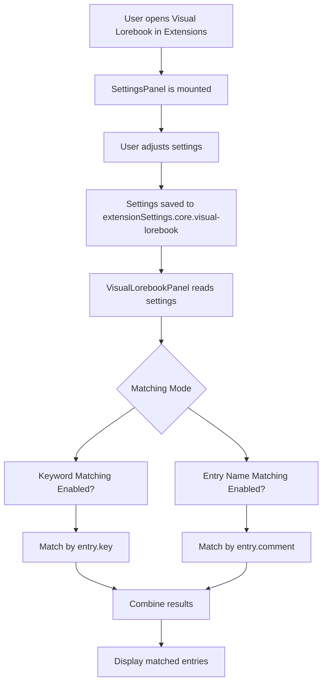

# Visual Lorebook - Settings Panel Implementation

## Overview

Add a settings panel to the Visual Lorebook extension with configurable options for keyword matching behavior.

## Current State Analysis

### Existing Settings (in [`types.ts`](../src/extensions/built-in/visual-lorebook/types.ts))

- `maxImageSize`: Max image size in bytes (default: 5MB)
- `maxVideoSize`: Max video size in bytes (default: 50MB)
- `enabled`: Boolean
- `lastSelectedLorebook`: Last selected lorebook filename
- `showOnlyActiveCharacters`: Show only characters mentioned in recent messages
- `activeCharacterLookback`: Number of messages to look back for character mentions (default: 3)
- `matchedEntryOrder`: Lorebook filename -> array of entry UIDs in matched order

### Current Matching Algorithm (in [`VisualLorebookPanel.vue`](../src/extensions/built-in/visual-lorebook/VisualLorebookPanel.vue))

- Uses `entry.key` (keywords from lorebook) for matching
- Matches against message text (after cleaning)
- Case-insensitive substring matching

### Missing Component

- No `SettingsPanel.vue` component exists
- The [`index.ts`](../src/extensions/built-in/visual-lorebook/index.ts) does not mount a settings panel

## New Settings to Add

### 1. Keyword Lookback Count (Numeric Input)

- **Setting**: `keywordLookbackCount`
- **Type**: `number`
- **Default**: `3`
- **Description**: Number of chat messages to look back on for keyword matches
- **Min/Max**: 1-20

### 2. Keyword Matching Toggle (Toggle Switch)

- **Setting**: `enableKeywordMatching`
- **Type**: `boolean`
- **Default**: `true`
- **Description**: Enable/disable matching by lorebook keywords (entry.key)

### 3. Entry Name Matching Toggle (Toggle Switch)

- **Setting**: `enableEntryNameMatching`
- **Type**: `boolean`
- **Default**: `false`
- **Description**: Enable matching by entry name (entry.comment field)

## Entry Name Matching Algorithm

### Rules

- Delimit the `comment` field by empty space to create an array of keywords
- Match must be **exact** or **possessive** (e.g., "Malvhira" matches "Malvhira" or "Malvhira's")
- Case-insensitive
- Ignore common English words: "the", "and", "a", "an", "or", "but", "in", "on", "at", "to", "for", "of", "with", "by"

### Example

**Comment**: `"Malvhira 'Hira' the Harpy"`

**Extracted keywords** (after stripping quotes and filtering common words):

- "Malvhira"
- "Hira" (single quotes removed)
- "Harpy"

**Matching content**:

- ✅ "Malvhira"
- ✅ "Malvhira's"
- ✅ "malvhira" (case-insensitive)
- ✅ "Hira"
- ✅ "Hira's"
- ✅ "Harpy"
- ✅ "Today Hira did this" (contains "Hira")
- ✅ "Today Hira's a cat" (contains "Hira's")

**Non-matching content**:

- ❌ "the" (common word)
- ❌ "Shira" (no exact match)
- ❌ "S-Malvhira" (not exact or possessive)
- ❌ "'Hira'" (quotes are stripped from keywords, so this would match "Hira")

### Algorithm Details

1. **Extract keywords from comment**:
   - Split by whitespace
   - Strip leading/trailing single or double quotes from each word
   - Filter out common English words

2. **Match against message text**:
   - Check if message text contains the keyword (case-insensitive)
   - OR check if message text contains the possessive form (keyword + "'s")

3. **Quote stripping examples**:
   - "'Hira'" → "Hira"
   - '"Hira"' → "Hira"
   - "Hira" → "Hira"
   - "'Hira's'" → "Hira's" (only outer quotes stripped)

## Implementation Plan

### Step 1: Update Types ([`types.ts`](../src/extensions/built-in/visual-lorebook/types.ts))

Add new settings to `VisualLorebookSettings` interface:

```typescript
export interface VisualLorebookSettings {
  maxImageSize: number;
  maxVideoSize: number;
  enabled: boolean;
  lastSelectedLorebook: string;
  showOnlyActiveCharacters: boolean;
  activeCharacterLookback: number;
  matchedEntryOrder: Record<string, number[]>;
  // NEW SETTINGS
  keywordLookbackCount: number;
  enableKeywordMatching: boolean;
  enableEntryNameMatching: boolean;
}
```

Update `defaultSettings`:

```typescript
export const defaultSettings: VisualLorebookSettings = {
  maxImageSize: 5 * 1024 * 1024,
  maxVideoSize: 50 * 1024 * 1024,
  enabled: true,
  lastSelectedLorebook: '',
  showOnlyActiveCharacters: false,
  activeCharacterLookback: 3,
  matchedEntryOrder: {},
  // NEW DEFAULTS
  keywordLookbackCount: 3,
  enableKeywordMatching: true,
  enableEntryNameMatching: false,
};
```

### Step 2: Create SettingsPanel Component ([`SettingsPanel.vue`](../src/extensions/built-in/visual-lorebook/SettingsPanel.vue))

Create a new Vue component following the pattern from [`roadway/SettingsPanel.vue`](../src/extensions/built-in/roadway/SettingsPanel.vue):

```vue
<script setup lang="ts">
import { computed, onMounted, ref, watch } from 'vue';
import { FormItem, Input, Toggle } from '../../../components/UI';
import type { ExtensionAPI } from '../../../types';
import { defaultSettings, type VisualLorebookSettings } from './types';

const props = defineProps<{
  api: ExtensionAPI<VisualLorebookSettings>;
}>();

const t = props.api.i18n.t;

const settings = ref<VisualLorebookSettings>({ ...defaultSettings });

onMounted(() => {
  const saved = props.api.settings.get();
  if (saved) {
    settings.value = { ...defaultSettings, ...saved };
  }
});

watch(
  settings,
  (newSettings) => {
    props.api.settings.set(undefined, newSettings);
    props.api.settings.save();
  },
  { deep: true },
);
</script>

<template>
  <div class="visual-lorebook-settings">
    <div class="group-header">General</div>
    <FormItem label="Enable Visual Lorebook">
      <Toggle v-model="settings.enabled" />
    </FormItem>

    <div class="group-header">Keyword Matching</div>
    <FormItem label="Enable Keyword Matching" description="Match entries by their keywords from the lorebook.">
      <Toggle v-model="settings.enableKeywordMatching" />
    </FormItem>

    <FormItem label="Keyword Lookback Count" description="Number of chat messages to look back for keyword matches.">
      <Input v-model.number="settings.keywordLookbackCount" type="number" :min="1" :max="20" />
    </FormItem>

    <div class="group-header">Entry Name Matching</div>
    <FormItem
      label="Enable Entry Name Matching"
      description="Match entries by their entry name (comment field). Matches exact words or possessive forms."
    >
      <Toggle v-model="settings.enableEntryNameMatching" />
    </FormItem>
  </div>
</template>

<style scoped>
.visual-lorebook-settings {
  display: flex;
  flex-direction: column;
  gap: var(--spacing-md);
  padding: var(--spacing-lg);
}
.group-header {
  font-weight: bold;
  font-size: 1.1em;
  color: var(--theme-text-color-primary);
  border-bottom: 1px solid var(--theme-border-color);
  padding-bottom: var(--spacing-xs);
  margin-top: var(--spacing-md);
}
</style>
```

### Step 3: Mount SettingsPanel in [`index.ts`](../src/extensions/built-in/visual-lorebook/index.ts)

Update the `activate` function to mount the settings panel:

```typescript
import { markRaw } from 'vue';
import type { ExtensionAPI } from '../../../types';
import { manifest } from './manifest';
import type { VisualLorebookSettings } from './types';
import VisualLorebookPanel from './VisualLorebookPanel.vue';
import SettingsPanel from './SettingsPanel.vue'; // NEW

export { manifest };

export function activate(api: ExtensionAPI<VisualLorebookSettings>) {
  // Mount settings panel
  const settingsContainer = document.getElementById(api.meta.containerId);
  if (settingsContainer) {
    api.ui.mount(settingsContainer, SettingsPanel, { api });
  }

  // Register sidebar panel on the RIGHT side
  api.ui.registerSidebar('visual-lorebook', markRaw(VisualLorebookPanel), 'right', {
    icon: 'fa-solid fa-photo-video',
    title: 'extensionsBuiltin.visualLorebook.title',
    props: { api },
  });

  // Register nav bar item
  api.ui.registerNavBarItem('visual-lorebook', {
    icon: 'fa-solid fa-photo-video',
    title: 'extensionsBuiltin.visualLorebook.title',
    onClick: () => {
      api.ui.openSidebar('visual-lorebook');
    },
  });

  // Cleanup function
  return () => {
    api.ui.unregisterSidebar('visual-lorebook', 'right');
    api.ui.unregisterNavBarItem('visual-lorebook');
  };
}
```

### Step 4: Add i18n Keys ([`locales/en.json`](../locales/en.json))

Add new keys under `extensionsBuiltin.visualLorebook`:

```json
"visualLorebook": {
  "title": "Visual Lorebook",
  "selectLorebook": "Select Lorebook",
  "selectEntry": "Selected",
  "selectEntryToUpload": "Select entry to add media to",
  "noEntriesWithMedia": "No entries with media in this lorebook",
  "searchPlaceholder": "Search entries with media...",
  "uploadMedia": "Upload Media",
  "replaceMedia": "Replace Media",
  "removeMedia": "Remove Media",
  "uploading": "Uploading...",
  "invalidFileType": "Invalid file type. Please select a media file.",
  "imageTooLarge": "Image too large. Maximum size is 5MB.",
  "videoTooLarge": "Video too large. Maximum size is 50MB.",
  "mediaUploaded": "Media uploaded successfully.",
  "mediaUploadFailed": "Failed to upload media.",
  "mediaRemoved": "Media removed successfully.",
  "deleteConfirm": "Are you sure you want to remove this media?",
  // NEW KEYS
  "settings": {
    "enable": "Enable Visual Lorebook",
    "keywordMatching": {
      "enable": "Enable Keyword Matching",
      "description": "Match entries by their keywords from the lorebook.",
      "lookbackCount": "Keyword Lookback Count",
      "lookbackDescription": "Number of chat messages to look back for keyword matches."
    },
    "entryNameMatching": {
      "enable": "Enable Entry Name Matching",
      "description": "Match entries by their entry name (comment field). Matches exact words or possessive forms."
    }
  }
}
```

### Step 5: Update VisualLorebookPanel.vue to Use New Settings

#### 5.1 Update `findMatchingVisualKeywords` function

Modify to respect the new settings and add entry name matching:

```typescript
// Common words to ignore in entry name matching
const COMMON_WORDS = new Set(['the', 'and', 'a', 'an', 'or', 'but', 'in', 'on', 'at', 'to', 'for', 'of', 'with', 'by']);

// Find visual keywords in message text
function findMatchingVisualKeywords(messageText: string): number[] {
  if (!selectedLorebook.value || !mediaMetadata.value) return [];

  const book = worldInfoStore.worldInfoCache[selectedLorebook.value];
  if (!book) return [];

  const text = cleanMessageText(messageText).toLowerCase();
  const matchedUids: number[] = [];

  const enableKeywordMatching = props.api.settings.get('enableKeywordMatching') ?? true;
  const enableEntryNameMatching = props.api.settings.get('enableEntryNameMatching') ?? false;

  // Scan all entries with media for keyword matches
  for (const [uidStr] of Object.entries(mediaMetadata.value.entries)) {
    const uid = Number(uidStr);
    const entry = book.entries.find((e) => e.uid === uid);

    if (!entry) continue;

    let matched = false;

    // Check keyword matching (if enabled)
    if (enableKeywordMatching) {
      for (const keyword of entry.key) {
        const trimmedKeyword = keyword.trim();
        if (trimmedKeyword && text.includes(trimmedKeyword.toLowerCase())) {
          console.log(
            `[Visual Lorebook] Keyword matched - Keyword: "${trimmedKeyword}", UID: ${uid}, Comment: "${entry.comment}"`,
          );
          matchedUids.push(uid);
          matched = true;
          break;
        }
      }
    }

    // Check entry name matching (if enabled and not already matched)
    if (!matched && enableEntryNameMatching) {
      const entryNameKeywords = extractEntryNameKeywords(entry.comment);
      for (const keyword of entryNameKeywords) {
        const keywordLower = keyword.toLowerCase();
        // Match exact keyword OR possessive form (e.g., "Hira" matches "Hira" or "Hira's")
        if (text.includes(keywordLower) || text.includes(`${keywordLower}'s`)) {
          console.log(
            `[Visual Lorebook] Entry name matched - Keyword: "${keyword}", UID: ${uid}, Comment: "${entry.comment}"`,
          );
          matchedUids.push(uid);
          matched = true;
          break;
        }
      }
    }
  }

  return matchedUids;
}

// Extract keywords from entry name (comment field)
function extractEntryNameKeywords(comment: string): string[] {
  // Delimit by whitespace
  const words = comment.split(/\s+/);

  // Filter out common words and strip quotes
  const keywords: string[] = [];
  for (const word of words) {
    const trimmed = word.trim();
    if (!trimmed) continue;

    // Check if it's a common word (case-insensitive)
    if (COMMON_WORDS.has(trimmed.toLowerCase())) continue;

    // Strip leading/trailing single or double quotes
    // Examples: "'Hira'" -> "Hira", '"Hira"' -> "Hira", "Hira" -> "Hira"
    const stripped = trimmed.replace(/^['"]|['"]$/g, '');

    if (stripped) {
      keywords.push(stripped);
    }
  }

  return keywords;
}
```

#### 5.2 Update `activeEntries` computed property

Use the new `keywordLookbackCount` setting instead of `activeCharacterLookback`:

```typescript
// Get entries that have been mentioned in recent messages
const activeEntries = computed(() => {
  if (!showOnlyActiveCharacters.value || !selectedLorebook.value || !mediaMetadata.value) {
    return new Set<number>();
  }

  const book = worldInfoStore.worldInfoCache[selectedLorebook.value];
  if (!book) return new Set<number>();

  // Use keywordLookbackCount instead of activeCharacterLookback
  const lookback = props.api.settings.get('keywordLookbackCount') ?? 3;
  const recentMessages = chatStore.activeChat?.messages.slice(-lookback) || [];
  const activeEntryUids = new Set<number>();

  const enableKeywordMatching = props.api.settings.get('enableKeywordMatching') ?? true;
  const enableEntryNameMatching = props.api.settings.get('enableEntryNameMatching') ?? false;

  for (const message of recentMessages) {
    const messageText = cleanMessageText(message.mes).toLowerCase();
    // Check each entry's keywords from lorebook
    for (const uidStr of Object.keys(mediaMetadata.value!.entries)) {
      const uid = Number(uidStr);
      const entry = book.entries.find((e) => e.uid === uid);

      if (!entry) continue;

      let matched = false;

      // Check keyword matching (if enabled)
      if (enableKeywordMatching) {
        for (const keyword of entry.key) {
          const trimmedKeyword = keyword.trim();
          if (trimmedKeyword && messageText.includes(trimmedKeyword.toLowerCase())) {
            console.log(
              `[Visual Lorebook] Active filter match - Keyword: "${trimmedKeyword}", UID: ${uid}, Comment: "${entry.comment}"`,
            );
            activeEntryUids.add(uid);
            matched = true;
            break;
          }
        }
      }

      // Check entry name matching (if enabled and not already matched)
      if (!matched && enableEntryNameMatching) {
        const entryNameKeywords = extractEntryNameKeywords(entry.comment);
        for (const keyword of entryNameKeywords) {
          const keywordLower = keyword.toLowerCase();
          // Match exact keyword OR possessive form (e.g., "Hira" matches "Hira" or "Hira's")
          if (messageText.includes(keywordLower) || messageText.includes(`${keywordLower}'s`)) {
            console.log(
              `[Visual Lorebook] Active filter match - Entry name: "${keyword}", UID: ${uid}, Comment: "${entry.comment}"`,
            );
            activeEntryUids.add(uid);
            matched = true;
            break;
          }
        }
      }
    }
  }

  return activeEntryUids;
});
```

## File Changes Summary

### New Files

- [`src/extensions/built-in/visual-lorebook/SettingsPanel.vue`](../src/extensions/built-in/visual-lorebook/SettingsPanel.vue) - Settings panel component

### Modified Files

1. [`src/extensions/built-in/visual-lorebook/types.ts`](../src/extensions/built-in/visual-lorebook/types.ts)
   - Add new settings to `VisualLorebookSettings` interface
   - Update `defaultSettings` with new defaults

2. [`src/extensions/built-in/visual-lorebook/index.ts`](../src/extensions/built-in/visual-lorebook/index.ts)
   - Import `SettingsPanel` component
   - Mount settings panel in `activate` function

3. [`locales/en.json`](../locales/en.json)
   - Add new i18n keys for settings labels and descriptions

4. [`src/extensions/built-in/visual-lorebook/VisualLorebookPanel.vue`](../src/extensions/built-in/visual-lorebook/VisualLorebookPanel.vue)
   - Add `extractEntryNameKeywords` helper function
   - Add `COMMON_WORDS` constant
   - Update `findMatchingVisualKeywords` to use new settings
   - Update `activeEntries` computed to use `keywordLookbackCount`

## Testing Checklist

- [ ] Settings panel displays correctly in Extensions drawer
- [ ] Enable/disable toggles work and persist
- [ ] Numeric input for keyword lookback count accepts valid range (1-20)
- [ ] Keyword matching toggle correctly enables/disables keyword matching
- [ ] Entry name matching toggle correctly enables/disables entry name matching
- [ ] Entry name matching correctly matches exact words
- [ ] Entry name matching correctly matches possessive forms (word's)
- [ ] Entry name matching ignores common words
- [ ] Entry name matching is case-insensitive
- [ ] Entry name matching strips single/double quotes from keywords (e.g., "'Hira'" -> "Hira")
- [ ] Entry name matching works with nicknames in quotes (e.g., "Malvhira 'Hira' the Harpy")
- [ ] Settings persist across page reloads
- [ ] Both matching modes can work together
- [ ] Active characters filter uses the new `keywordLookbackCount` setting

## Mermaid Diagram


