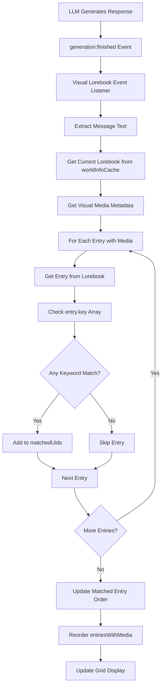

# Visual Lorebook: Use Lorebook Entry Keywords

## Overview

Update the Visual Lorebook extension to use the existing keywords from lorebook entries (`entry.key: string[]`) instead of a separate `visualKeyword` field. This eliminates data duplication and simplifies the matching logic.

## Current State

- Each `WorldInfoEntry` has a `key: string[]` array of keywords (from the original lorebook)
- Visual lorebook has a separate `visualKeyword: string` field in `VisualLorebookMediaData`
- Matching algorithm checks if message contains the single `visualKeyword` from media metadata
- UI allows editing visual keywords when uploading and viewing existing media

## Proposed Changes

### 1. Remove `visualKeyword` from Types

**File:** `src/extensions/built-in/visual-lorebook/types.ts`

Remove the `visualKeyword` field from `VisualLorebookMediaData`:

```typescript
// Before
export interface VisualLorebookMediaData {
  mediaId: string;
  mediaType: 'image' | 'video';
  uploadedAt: string;
  visualKeyword: string; // REMOVE THIS
}

// After
export interface VisualLorebookMediaData {
  mediaId: string;
  mediaType: 'image' | 'video';
  uploadedAt: string;
}
```

### 2. Update Matching Algorithm

**File:** `src/extensions/built-in/visual-lorebook/VisualLorebookPanel.vue`

Change `findMatchingVisualKeywords()` to use the lorebook entry's `key` array:

```typescript
// Before - uses visualKeyword from media metadata
function findMatchingVisualKeywords(messageText: string): number[] {
  if (!selectedLorebook.value || !mediaMetadata.value) return [];

  const text = messageText.toLowerCase();
  const matchedUids: number[] = [];

  // Scan all entries with media for keyword matches
  for (const [uidStr, mediaData] of Object.entries(mediaMetadata.value.entries)) {
    const uid = Number(uidStr);
    const keyword = mediaData.visualKeyword?.trim();

    if (keyword && text.includes(keyword.toLowerCase())) {
      matchedUids.push(uid);
    }
  }

  return matchedUids;
}

// After - uses key array from lorebook entry
function findMatchingVisualKeywords(messageText: string): number[] {
  if (!selectedLorebook.value || !mediaMetadata.value) return [];

  const book = worldInfoStore.worldInfoCache[selectedLorebook.value];
  if (!book) return [];

  const text = messageText.toLowerCase();
  const matchedUids: number[] = [];

  // Scan all entries with media for keyword matches
  for (const [uidStr, mediaData] of Object.entries(mediaMetadata.value.entries)) {
    const uid = Number(uidStr);
    const entry = book.entries.find((e) => e.uid === uid);

    if (!entry) continue;

    // Check if ANY of the entry's keywords match
    for (const keyword of entry.key) {
      const trimmedKeyword = keyword.trim();
      if (trimmedKeyword && text.includes(trimmedKeyword.toLowerCase())) {
        matchedUids.push(uid);
        break; // Only add once per entry
      }
    }
  }

  return matchedUids;
}
```

### 3. Update `activeEntries` Computed

**File:** `src/extensions/built-in/visual-lorebook/VisualLorebookPanel.vue`

Update the `activeEntries` computed to use lorebook entry keywords:

```typescript
// Before
const activeEntries = computed(() => {
  if (!showOnlyActiveCharacters.value || !selectedLorebook.value || !mediaMetadata.value) {
    return new Set<number>();
  }

  const lookback = props.api.settings.get('activeCharacterLookback');
  const recentMessages = chatStore.activeChat?.messages.slice(-lookback) || [];
  const activeEntryUids = new Set<number>();

  for (const message of recentMessages) {
    const messageText = message.mes.toLowerCase();
    // Check each entry's visual keyword
    for (const [uidStr, mediaData] of Object.entries(mediaMetadata.value!.entries)) {
      const uid = Number(uidStr);
      const keyword = mediaData.visualKeyword?.trim();
      if (keyword && messageText.includes(keyword.toLowerCase())) {
        activeEntryUids.add(uid);
      }
    }
  }

  return activeEntryUids;
});

// After
const activeEntries = computed(() => {
  if (!showOnlyActiveCharacters.value || !selectedLorebook.value || !mediaMetadata.value) {
    return new Set<number>();
  }

  const book = worldInfoStore.worldInfoCache[selectedLorebook.value];
  if (!book) return new Set<number>();

  const lookback = props.api.settings.get('activeCharacterLookback');
  const recentMessages = chatStore.activeChat?.messages.slice(-lookback) || [];
  const activeEntryUids = new Set<number>();

  for (const message of recentMessages) {
    const messageText = message.mes.toLowerCase();
    // Check each entry's keywords from lorebook
    for (const uidStr of Object.keys(mediaMetadata.value!.entries)) {
      const uid = Number(uidStr);
      const entry = book.entries.find((e) => e.uid === uid);

      if (!entry) continue;

      // Check if ANY of the entry's keywords match
      for (const keyword of entry.key) {
        const trimmedKeyword = keyword.trim();
        if (trimmedKeyword && messageText.includes(trimmedKeyword.toLowerCase())) {
          activeEntryUids.add(uid);
          break;
        }
      }
    }
  }

  return activeEntryUids;
});
```

### 4. Remove Visual Keyword State and UI

**File:** `src/extensions/built-in/visual-lorebook/VisualLorebookPanel.vue`

Remove the following:

1. **State variables:**

   ```typescript
   // REMOVE THESE
   const visualKeywordForUpload = ref<string>('');
   const visualKeywordForEdit = ref<string>('');
   const isSavingKeyword = ref(false);
   ```

2. **Debounced save function:**

   ```typescript
   // REMOVE THIS ENTIRE FUNCTION
   const debouncedSaveVisualKeyword = debounce(async () => { ... }, 500);
   ```

3. **Visual keyword change handler:**

   ```typescript
   // REMOVE THIS FUNCTION
   function handleVisualKeywordChange(value: string | number | (string | number)[]) { ... }
   ```

4. **Watcher for mediaData:**

   ```typescript
   // REMOVE THIS WATCHER
   watch(mediaData, (newData) => {
     const entryKeyword = newData?.visualKeyword || '';
     visualKeywordForEdit.value = entryKeyword;
   });
   ```

5. **Template UI elements:**
   - Visual keyword input in the media preview section (lines 519-527)
   - Visual keyword input in the upload section (lines 595-600)

### 5. Update Upload Handler

**File:** `src/extensions/built-in/visual-lorebook/VisualLorebookPanel.vue`

Remove visual keyword from the upload handler:

```typescript
// Before
await updateMediaMetadata(selectedLorebook.value, {
  entryUid,
  mediaData: {
    mediaId,
    mediaType,
    uploadedAt: new Date().toISOString(),
    visualKeyword: visualKeywordForUpload.value.trim(), // REMOVE THIS
  },
});

// After
await updateMediaMetadata(selectedLorebook.value, {
  entryUid,
  mediaData: {
    mediaId,
    mediaType,
    uploadedAt: new Date().toISOString(),
  },
});
```

Also remove the line that clears `visualKeywordForUpload`:

```typescript
// REMOVE THIS LINE
visualKeywordForUpload.value = '';
```

### 6. Remove i18n Keys

**File:** `locales/en.json`

Remove the following keys from the `extensionsBuiltin.visualLorebook` section:

- `"visualKeyword": "Visual Keyword"`
- `"visualKeywordPlaceholder": "Enter keyword..."`
- `"visualKeywordSaved": "Visual keyword saved."`
- `"visualKeywordSaveFailed": "Failed to save visual keyword."`

### 7. Data Migration (Optional)

Existing visual lorebook JSON files may have `visualKeyword` fields. These will be ignored by the new code, but could be cleaned up via a migration script if desired.

## Architecture Diagram



## Benefits

1. **No data duplication**: Keywords are stored once in the lorebook entry
2. **Simplified UI**: No need to edit keywords separately
3. **Better matching**: Can match against multiple keywords per entry
4. **Consistency**: Visual lorebook uses the same keywords as the regular lorebook

## Testing Checklist

- [ ] Verify matching works with multiple keywords per entry
- [ ] Verify matching is case-insensitive (as before)
- [ ] Verify active character filter works with new keyword logic
- [ ] Verify media upload still works without visual keyword
- [ ] Verify existing visual lorebook entries still display correctly
- [ ] Verify no TypeScript errors
- [ ] Run linter and formatter
